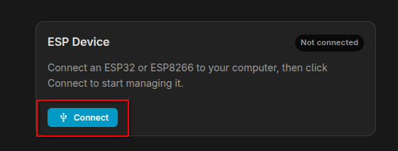
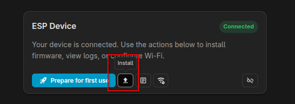
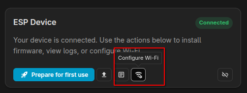

# Installation and updates

This guide applies to **this repository's firmware**. It does not apply to
Michał Zaniewicz's stock-ESPHome implementation, whose audio architecture and
package source are different.

## Choose an installation method

The **precompiled firmware is the recommended installation method**. It gives
every board a unique name, accepts Wi-Fi credentials after flashing and can
install future releases without compiling ESPHome.

| Method | Recommended for | Requirements | Compile-time customization |
|---|---|---|---|
| Precompiled release | Almost every user | Board, USB data cable, compatible browser and Home Assistant | No; use the firmware defaults and its Home Assistant entities |
| Source/YAML build | Developers and users who need different substitutions or firmware code | ESPHome 2026.8.0+, a sufficiently capable build host, YAML and local secrets | Yes |

Both methods expose the normal runtime controls in Home Assistant, including
wake words, sensitivity, post-AFE microphone gain, microphone mute, sounds,
LED brightness and phase effects. A source build is needed only for settings
that must be compiled into the image, such as an exact device name, volume
limits, hidden-SSID behavior, a custom boot-sound source or firmware changes.

## Recommended: install a precompiled release

### 1. Choose stable or beta

- A normal GitHub release is the **stable** channel.
- A GitHub pre-release is the public **beta** channel. Anyone may test it.
- The moving `dev` branch is development source, not a firmware channel for
  ordinary users or beta testers.

Precompiled assets begin with the forthcoming 48 kHz release series. The
historical `v1.1.0` release predates this distribution method and does not
contain the factory or managed-OTA images described here.

Download `waveshare-voice-esp32s3.factory.bin` from the selected entry on the
[GitHub Releases page](https://github.com/jyoushiki/esphome-waveshare-esp32-s3-audio-va/releases).
Use the `.factory.bin` file for a USB installation. The `.ota.bin` asset is for
the firmware's managed updater and must not be selected for the first flash.

### 2. Flash it over USB

1. Open [ESPHome Web](https://web.esphome.io/) in a Chromium-based browser with
   Web Serial support, such as Chrome or Edge.
2. Connect the board with a USB data cable and select **Connect**:

   

3. Once ESPHome Web reports `Connected`, select the small **Install** button
   with the upward-arrow icon:

   

> [!IMPORTANT]
> Use the small **Install** button highlighted above, **not** the large blue
> **Prepare for first use** button. Prepare for first use installs ESPHome's
> generic preparation image rather than this project's downloaded firmware.

4. Select the downloaded `.factory.bin` file and wait for the installation and
   reboot to complete.

Close serial monitors and other applications using the port first. If Improv
remains at `Connecting` or the browser reports that the device was lost,
disconnect and reconnect the board and try again. Browser privacy protections
can interfere with Web Serial; retry in Chrome or Edge before diagnosing the
firmware.

### 3. Provision Wi-Fi

Reconnect to the board if necessary, then use ESPHome Web's **Configure Wi-Fi**
button:



The firmware accepts the credentials through **Improv Serial** and stores them
on the board; no Wi-Fi password is embedded in the downloadable image.

The universal image appends the board's MAC suffix to its hostname, producing
a name similar to `waveshare-voice-b2b31c`. This allows the same binary to be
installed on multiple boards without hostname or entity collisions.

### 4. Add it to Home Assistant

After the board joins Wi-Fi:

1. Add or accept the discovered ESPHome integration.
2. Assign the desired Assist pipeline when Home Assistant prompts for it.
3. Wait for the one-shot startup sound.
4. Say **OK Nabu**. It is the first configured model and therefore the only one
   enabled on a new installation by default.
5. Enable `Hey Jarvis`, `Alexa` or `Hey Mycroft` from Home Assistant if desired.
   Their enabled states are saved in flash.

### Managed precompiled updates

Precompiled installations expose two diagnostic update entities:

- **Stable firmware** is enabled by default.
- **Beta firmware** is disabled by default.

For normal use, leave Stable firmware enabled and Beta firmware disabled. To
join the public beta channel, disable the Stable firmware entity in Home
Assistant's entity settings and enable Beta firmware. Keep **exactly one** of
the two entities enabled.

The updater currently compares firmware versions for equality rather than
ordering them semantically. If both channels are enabled, an older stable
version can therefore be presented as an available update while the device is
running a newer beta. Selecting only one channel avoids that ambiguity.

Beta pre-releases update the beta manifest only. A normal release updates both
manifests, so beta users also receive the new stable firmware. The
device downloads the appropriate `.ota.bin`, verifies its published hash,
installs it and reboots. Wi-Fi credentials, wake-word selections and other
saved preferences are retained.

The board must be able to reach
`jyoushiki.github.io` over HTTPS for update checks and downloads. It does not
need a build host or ESPHome Device Builder for managed updates.

## Advanced: build from the YAML source

Use this method only when you explicitly want to compile the firmware, modify
its substitutions, add diagnostic packages or develop its code.

### Requirements

You need:

- A Waveshare ESP32-S3-AUDIO-Board with its onboard 8 MB octal PSRAM.
- Home Assistant with an Assist pipeline.
- ESPHome 2026.8.0 or newer, using the ESP-IDF framework.
- A USB data cable for the first installation.
- A build host with enough memory for ESP-IDF, ESP-SR and the wake-word models.
- `waveshare-va.yaml` and `secrets.yaml` in the same ESPHome configuration
  directory.

The build host needs internet access to fetch this repository, the external
audio component, sound assets and wake-word models.

### 1. Create `secrets.yaml`

Copy `secrets.example.yaml` to `secrets.yaml` and enter the Wi-Fi credentials:

```yaml
wifi_ssid: "YOUR_WIFI_SSID"
wifi_password: "YOUR_WIFI_PASSWORD"
```

Do not commit this file. If the credentials change, update this local copy
before rebuilding or flashing.

### 2. Prepare the thin device file

Copy `waveshare-va.yaml` and edit its `substitutions:` values as needed:

```yaml
substitutions:
  name: waveshare-voice
  friendly_name: "Waveshare Voice"
  wifi_ssid: !secret wifi_ssid
  wifi_password: !secret wifi_password
  volume_min: '0.4'
  volume_max: '0.8'
  hidden_ssid: 'false'
```

`name` must be a valid ESPHome hostname. Changing it after Home Assistant has
discovered the device may create new entity identifiers.

Pin the package to the release or pre-release tag you intend to build:

```yaml
packages:
  core:
    url: https://github.com/jyoushiki/esphome-waveshare-esp32-s3-audio-va
    ref: <release-tag>
    files:
      - base/core.yaml
    refresh: 1d
```

An immutable tag or full commit SHA produces a reproducible build. `dev` moves
with active development and is appropriate only when intentionally testing the
latest source. There is no separate `beta` branch: public betas are frozen by
pre-release tags.

Keep personal names and credentials only in the thin local file. Do not edit a
downloaded `base/core.yaml` inside ESPHome's package cache.

### 3. Build and install

From a workstation with ESPHome installed:

```bash
esphome run waveshare-va.yaml
```

In Home Assistant's ESPHome Device Builder, place `waveshare-va.yaml` and
`secrets.yaml` in its configuration directory, open the device and select
**Install**. Use USB for the first flash; later source builds can use ESPHome's
normal OTA service.

A clean first build is large and can take several minutes. If the compiler ends
with this message:

```text
xtensa-esp-elf-g++: fatal error: Killed signal terminated program cc1plus
```

the operating system killed the compiler because the build host ran out of
memory. It is not a board failure. Use the recommended precompiled firmware or
build on a machine with more available RAM or swap.

After changing a tag, branch, commit or external-component revision, clean the
build files once:

```bash
esphome clean waveshare-va.yaml
esphome run waveshare-va.yaml
```

Source-built installations do not include the precompiled wrapper's Stable
firmware and Beta firmware entities. Update them by rebuilding and installing
the selected revision through ESPHome.

## Network access

For a normal Home Assistant installation, allow at least:

- Home Assistant/ESPHome to reach the device's native API on TCP 6053.
- The board to reach the HTTP or HTTPS URLs supplied for TTS, announcements and
  Music Assistant media.
- Precompiled installations to reach `jyoushiki.github.io` over HTTPS for
  managed updates.
- For source builds, the build host to reach GitHub over HTTPS and the ESPHome
  host to reach the device's OTA service.

Media ports are installation-dependent. Ports such as 8095 or 8097 may appear
in Music Assistant URLs, but they are not universal defaults: allow the actual
destination and port shown in the failed URL or logs.

If the IoT network can reach Home Assistant's API but not its media URLs, wake
word and speech recognition may work while replies or music fail with messages
such as:

```text
Failed to open URL
ESP_ERR_HTTP_CONNECT
Media reader encountered an error
```

That is normally a routing, DNS, TLS or firewall problem rather than an audio
codec failure.

## Temporarily record the audio received by Assist

Home Assistant can save the audio received by its Assist pipeline as WAV files.
This is useful for checking input level, clipping, residual echo, metallic audio
or a command whose beginning or end was lost. For this firmware, it lets you
hear the signal after the board's AFE processing rather than the unprocessed TDM
channels.

> **Enable this only while diagnosing a problem.** Recordings accumulate without
> automatic retention, contain speech and background audio, and may consume a
> significant amount of storage. A 16 kHz, 16-bit mono WAV requires about 1.9 MB
> per minute of audio; repeated Assist runs and multiple recording stages add up.

Add this block to Home Assistant's `configuration.yaml`, not to the ESPHome
device YAML:

```yaml
assist_pipeline:
  debug_recording_dir: /config/assist_pipeline_debug
```

If an `assist_pipeline:` section already exists, add only
`debug_recording_dir:` beneath it instead of creating a second section. Check
the Home Assistant configuration and restart Home Assistant to apply the
change. The destination directory and its subdirectories are created
automatically.

Run the voice-assistant tests you want to capture, then inspect:

```text
/config/assist_pipeline_debug/<device_id>/<pipeline_name>/<run_id>/
```

Depending on where the pipeline starts, a run may contain:

- `00_wake-<wake_word_entity>.wav`: audio used for server-side wake-word
  detection.
- `01_stt-<speech_to_text_engine>.wav`: audio sent through the speech-to-text
  stage. With the wake word detected locally on this board, this is normally
  the relevant file.

The files are 16 kHz, 16-bit mono WAVs. They can be downloaded using a Home
Assistant file-management add-on, Samba or SSH and opened in an audio editor.
Before sharing one, listen for private speech and background audio and redact or
trim it as appropriate.

When testing is complete, remove `debug_recording_dir` (or the complete
`assist_pipeline` block if it contains nothing else), restart Home Assistant,
and delete the accumulated directory after verifying that it contains only the
diagnostic recordings you no longer need.

## Validation checklist

Before declaring an installation healthy, verify:

- The startup sound has the correct speed and pitch.
- The wake word is detected at a normal speaking distance.
- Capture ends naturally after the command rather than timing out.
- Assist plays a complete response and returns to idle.
- Music plays at the expected speed and can be paused with the center button.
- A wake word during music ducks playback and the Assist response completes.
- Key 1 raises volume, Key 3 lowers it, and the LED ring shows the level.
- A voice timer counts down, rings and can be stopped.
- Rebooting preserves microphone mute and wake-word selections.

For a precompiled installation, also verify that the selected update entity
reports the installed version as up to date. For a beta update test, confirm
that the device returns online with its Wi-Fi and saved settings intact.

## Rolling back or recovering

For a precompiled installation, download the previous known-good
`waveshare-voice-esp32s3.factory.bin` from its GitHub release and install it over
USB with ESPHome Web. An ordinary flash does not require erasing the device;
avoid **Erase device** unless you intentionally want to remove Wi-Fi credentials
and saved preferences.

For a source build:

1. Replace `ref:` with the previous known-good commit SHA or release tag.
2. Run `esphome clean waveshare-va.yaml`.
3. Build and install again over OTA or USB.

## Reporting a beta issue

Include:

- Release or pre-release tag and installed firmware version.
- Installation method: precompiled or source build.
- ESPHome version for a source build, and Home Assistant version.
- Board revision, if known.
- Whether it followed a cold power-on, reboot, OTA update or runtime setting
  change.
- The exact sequence that reproduces it.
- Relevant logs from boot through the failure.
- Whether music was playing and whether AEC/AFE processing was enabled.
- A short recording when the problem concerns gain, echo or audio artifacts.

Remove Wi-Fi credentials, API keys, private URLs and tokens before sharing logs
or configuration files.
