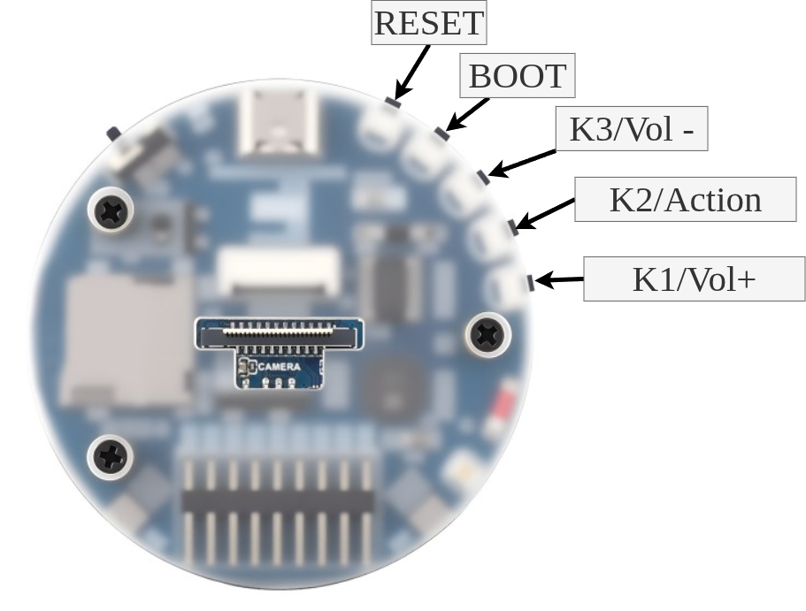

# Using the voice assistant

This guide describes the controls and Home Assistant entities exposed by this
firmware. Names below are shown without the device-friendly-name prefix that
Home Assistant may add.

## Physical controls

| Board button | Action |
|---|---|
| Key 1 | Raise media-player volume by 5% |
| Key 2 | Contextual action: stop ringing, Assist or an announcement; control music; or start Assist |
| Key 3 | Lower media-player volume by 5% |
| Boot | Toggle microphone privacy mute |

Changing volume briefly turns the seven LEDs into a cyan level bar. The bar
starts beside one edge of the USB-C connector and fills around the ring towards
the other edge.

Muting through Boot and changing the `Microphone Mute` entity in Home Assistant
control the same persisted state. A solid red ring indicates that every
microphone consumer, including wake-word detection, is receiving silence. The
ring acknowledges the change with a brief bright-red pulse, then remains dim
red while mute is active so it is not distracting at night.

`Reset` restarts the board. Holding Boot while resetting still enters the
ESP32-S3 download bootloader; an ordinary press after startup toggles mute.

## Wake words

Four on-device models are installed:

- OK Nabu
- Hey Jarvis
- Alexa
- Hey Mycroft

ESPHome enables only the first model, **OK Nabu**, on the first boot. Home
Assistant exposes a switch for each model so that the alternatives can be
enabled or disabled without rebuilding. Their enabled states are stored in
flash and restored after reboot.

Enabling more models makes more phrases available, but also gives the detector
more opportunities for a false activation. Start with one model while checking
the installation.

`Wake word sensitivity` changes the detection thresholds of all four models:

- **Slightly sensitive** is the conservative default and should produce fewer
  false activations.
- **Moderately sensitive** is a middle ground for a quiet room or a more distant
  speaker.
- **Very sensitive** is most permissive and may respond at greater distance, at
  the cost of more false activations.

## Everyday Home Assistant controls

| Entity | Purpose | Remembered after reboot? |
|---|---|---|
| Microphone Mute | Supplies silence to every microphone consumer, including the local wake-word detector | Yes |
| Mic gain (post-AFE) | Applies gain after AEC and dual-mic processing; defaults to 0 dB on first boot | Yes |
| Wake word sensitivity | Selects the probability thresholds used by all wake-word models | Yes |
| Wake sound | Enables the short acknowledgement chime before Assist capture | Yes |
| Boot sound | Enables the one-shot ready sound after connecting to Home Assistant | Yes |
| LED Ring Brightness | Sets the brightness used by firmware-controlled ring states | Yes |
| Listening effect | Selects the animation used while speech is being captured | Yes |
| Thinking effect | Selects the animation used while Home Assistant processes a request | Yes |
| Replying effect | Selects the animation used while the reply is played | Yes |
| Next timer | Reports the remaining duration of the closest active voice timer | Runtime only |
| Next timer name | Reports the name of the closest active voice timer | Runtime only |

`Mic gain (post-AFE)` does not change the ES7210 analog gains or the balance
between the two microphones and playback-reference channel seen by AEC. It is
therefore the appropriate live control for correcting the level delivered to
wake-word detection and Home Assistant. Increase it cautiously: clipping cannot
be repaired later in the pipeline. For objective comparison, use the temporary
WAV-recording procedure in the
[installation guide](INSTALLATION.md#temporarily-record-the-audio-received-by-assist).

## Firmware update entities

The recommended precompiled installation adds two diagnostic entities:

| Entity | Default availability | Purpose |
|---|---|---|
| Stable firmware | Enabled | Follows normal GitHub releases |
| Beta firmware | Disabled | Follows public GitHub pre-releases |

Use only one channel at a time. Normal users leave Stable firmware enabled;
beta testers disable it and enable Beta firmware from Home Assistant's entity
settings. See [Managed precompiled updates](INSTALLATION.md#managed-precompiled-updates)
for the update behavior and channel limitation. Source/YAML builds use
ESPHome's normal rebuild-and-upload workflow and do not expose these entities.

## Advanced and diagnostic entities

Some entities are disabled by default in Home Assistant. Enable them from the
device's entity list only for troubleshooting or expert tuning:

| Entity | Normal state | What changing it does |
|---|---|---|
| Echo cancellation | On | Disables only AEC; dual-mic speech enhancement and post-AFE AGC remain active |
| AFE processing | On | Bypasses the complete processed path for an A/B comparison with converted raw microphone audio |
| Logger Level | Build default | Changes runtime logging verbosity |
| Restart | — | Reboots the ESPHome device |

`AFE processing` is a diagnostic switch, not a listening-quality preference.
Turning it off removes AEC, dual-mic processing and AGC from the published
microphone path. Return it to **on** after a comparison.

The amplifier-enable switch and factory-reset button are intentionally internal
and are not exposed for normal control. The amplifier follows audio ownership
automatically; manually controlling it would make the hardware state disagree
with the playback pipeline.

## LED ring states

| Ring state | Meaning |
|---|---|
| Rainbow during startup | Firmware is initializing; red-dominant before Wi-Fi and violet-dominant after Wi-Fi |
| Pulsing red | Wi-Fi or the Home Assistant API is unavailable |
| Solid violet | Wake word accepted; waiting for the command |
| Configurable violet animation | Listening, thinking or replying, according to the active phase |
| Slowly pulsing violet | At least one voice timer is counting down |
| Quickly pulsing violet | A timer is ringing |
| Quickly pulsing red | Assist pipeline error |
| Dim solid red | Microphone privacy mute is active |
| Cyan level bar | Volume was changed |
| Off | Connected and idle |

The listening, thinking and replying effects may be different even though the
phase colour remains violet. This makes the activity recognizable without
giving arbitrary control of the status light to Home Assistant.

## Music, announcements, timers and external ringing

The media player accepts ordinary media as well as announcements. An
announcement ducks ongoing music, and starting Assist ducks music more strongly
while the microphone is being captured. Music resumes its previous level when
the interaction finishes.

Voice timers are managed by the Assist pipeline. When a timer finishes, its
sound repeats until stopped or until the 15-minute safety timeout expires.
Saying an enabled wake word while the timer is ringing stops it instead of
starting a new Assist request.

Home Assistant owns calendar and alarm scheduling. Two device actions expose
the same local ringing behaviour to automations:

- `start_ringing` starts the repeating timer sound, ducks music and shows the
  ringing LED state.
- `stop_ringing` stops the sound and restores the normal audio and LED states.

In Home Assistant their generated action names include the ESPHome node name,
for example `esphome.waveshare_voice_start_ringing` and
`esphome.waveshare_voice_stop_ringing`. The ringing safety timeout remains 15
minutes, and saying an enabled wake word also stops it.

Key 2 is a contextual action button. Each press performs the first applicable
action in this order:

1. Stop a voice timer or external ring request.
2. Cancel the active Assist interaction.
3. Stop the current announcement or TTS response.
4. Pause or resume music.
5. Start Assist manually when the device is otherwise idle.

Stopping a ring or controlling playback remains available while the microphone
is muted. Manual Assist start is ignored until microphone privacy mute is
disabled.
